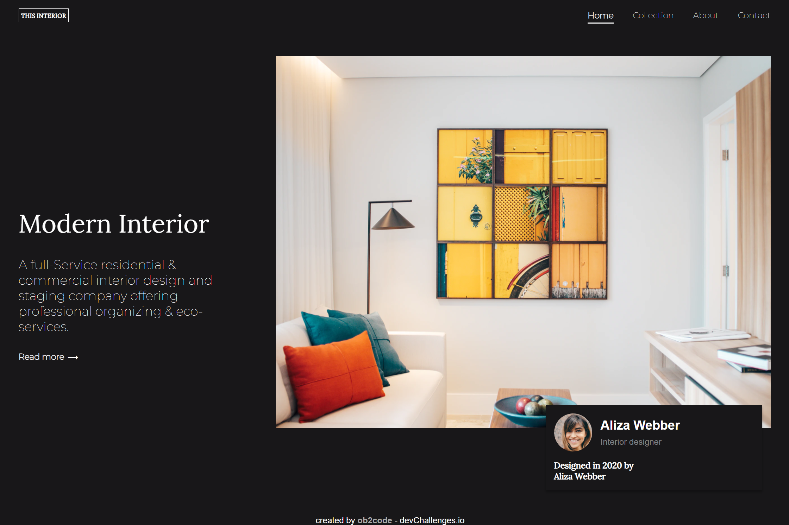
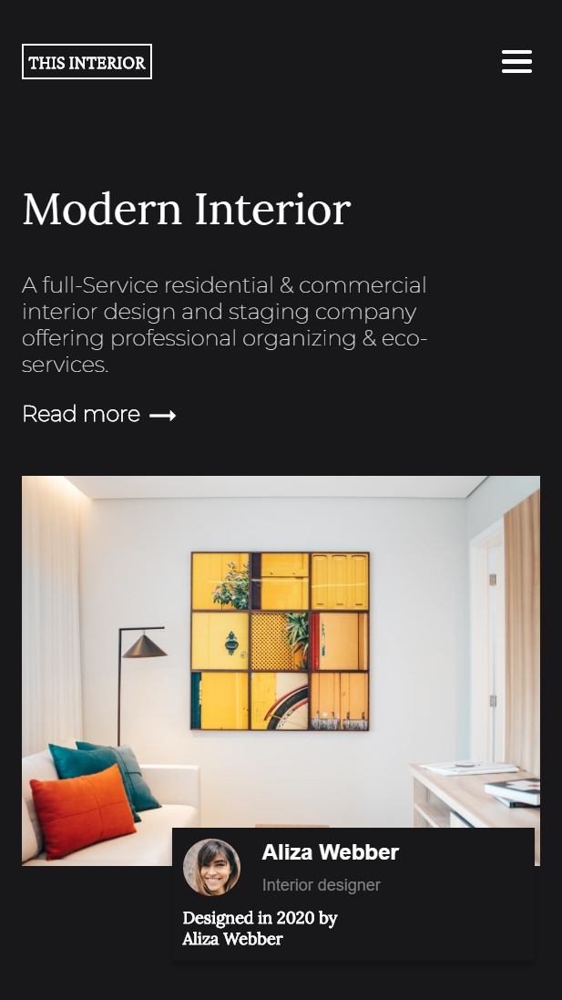

<!-- Please update value in the {}  -->

<h1 align="center">Interior Consultant</h1>

   Solution for a challenge from  <a href="http://devchallenges.io" target="_blank">Devchallenges.io</a>.

  <h3>
    <a href="https://ob2code-interior-consultant.netlify.app/">
      Demo
    </a>
     | 
    <a href="https://github.com/ob2code/interior-consultant.git">
      Solution
    </a>
     | 
    <a href="https://devchallenges.io/challenges/Jymh2b2FyebRTUljkNcb">
      Challenge
    </a>
  </h3>

<!-- TABLE OF CONTENTS -->

## Table of Contents

- [Overview](#overview)
  - [Built With](#built-with)
- [Features](#features)
- [Contact](#contact)
- [Acknowledgements](#acknowledgements)

<!-- OVERVIEW -->

## Overview

Desktop screenshot

Mobile screenshot

Hello! Have a nice day.

- You can reach my demo website at this <a href="https://ob2code-interior-consultant.netlify.app/">
      link
    </a>
- This is my first project I apply SASS & Javascript to toggle menu bar.
- SASS is exciting, I have to change a litte bit thinking to adapt it. Mixin and @extend are wonderful.

### Built With

<!-- This section should list any major frameworks that you built your project using. Here are a few examples.-->

- HTML, CSS & Javascript
- SASS

## Features

<!-- List the features of your application or follow the template. Don't share the figma file here :) -->

This application/site was created as a submission to a [DevChallenges](https://devchallenges.io/challenges) challenge. The [challenge](https://devchallenges.io/challenges/Jymh2b2FyebRTUljkNcb) was to build an application to complete the given user stories.

## Acknowledgements

<!-- This section should list any articles or add-ons/plugins that helps you to complete the project. This is optional but it will help you in the future. For exmpale -->

- [Steps to replicate a design with only HTML and CSS](https://devchallenges-blogs.web.app/how-to-replicate-design/)
- [Animate a Website using CSS (transition, transform, keyframes, animation) | CSS Tutorial](https://devchallenges.io/learn/tutorial/css-animation)

## Contact

- 💻Website [ob2code.netlify.app](https://ob2code.netlify.app/)
- 👨‍💻GitHub [@ob2code](https://github.com/ob2code)
- 🐤Twitter [@ob2code](https://twitter.com/ob2code)

